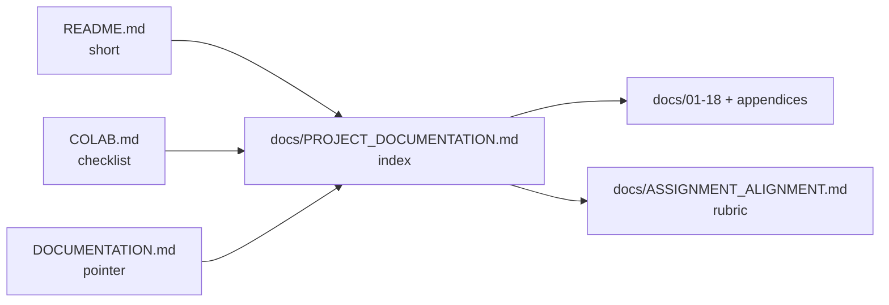

# 01 — Introduction & Scope

## 1.1 What this project is

The **Simon** repository is a research and education codebase that combines:

1. A **faithful implementation** of the SIMON lightweight block cipher family, with emphasis on **SIMON 32/64** (32-bit blocks, 64-bit keys, 32 rounds).
2. A **synthetic data and feature pipeline** for studying **statistical anomalies** in ciphertext blocks.
3. **Machine learning detectors** — primarily a **PyTorch autoencoder** trained in a one-class setting on “normal” ciphertext features.
4. An **assignment-oriented cryptanalysis layer** (`experiments/`) that evaluates models across **varying round counts** and trains a **neural distinguisher** (reduced-round Simon pairs vs random pairs).

The project is **not** a production cryptography product, a key-recovery tool, or a hosted service. It is designed for **reproducible experiments**, coursework, and exploratory research.

---

## 1.2 Primary use cases

| Use case | Layer | Typical workflow |
|----------|-------|------------------|
| Verify SIMON 32/64 against spec test vectors | `simon.py`, `simon3264` | `pytest test_simon.py` |
| Generate labelled fault datasets | `simon3264.dataset` | `generate_labeled_dataset` or `ml/train.py` |
| Train anomaly detector on normal ciphertext | `ml/` | `python ml/train.py --torch-only` |
| Score external captures (hex/bin/npz) | `ml/score.py` | `score-file` subcommand |
| Assignment: round-count effectiveness | `experiments/round_sweep.py` | Track A |
| Assignment: automated distinguisher | `experiments/run_distinguisher.py` | Track B |
| Full assignment pipeline + report | `experiments/run_all.py` | Both tracks + `ASSIGNMENT_SUMMARY.md` |

---

## 1.3 Goals

- Implement **SIMON 32/64** per Beaulieu et al. (2013), including official Appendix B test vector.
- Provide **reproducible** synthetic datasets: normal encryption + **injected faults** as labelled anomalies.
- Train and evaluate **anomaly detection** with precision/recall/FPR/AUC and per-fault breakdown.
- Support **Google Colab** with PyTorch and matplotlib.
- Satisfy coursework-style requirements for **deep learning on ciphertext**, **varying rounds**, and **automated cryptanalysis** (via the distinguisher track — see [07](07-experiments-cryptanalysis.md)).

---

## 1.4 Non-goals (explicit)

| Non-goal | Rationale |
|----------|-----------|
| Production deployment | No HSM integration, no SLA, no auth |
| Constant-time / side-channel safe code | Research implementation; documented in `simon.py` |
| Full 32-round **key recovery** | Distinguisher ≠ break; see [17](17-security-limitations.md) |
| CBC / GCM / AEAD modes | ECB-style independent 32-bit blocks only |
| CSV-native training ingest | Convert to hex/NPZ; use `score-file` |
| Central database | File-based NPZ/cache only |
| Environment-variable-based secrets | No secrets; YAML + CLI only |

**Important nuance:** The repository **does** include a **neural distinguisher** (binary classifier on ciphertext pairs) under `experiments/`. That is **automated cryptanalysis** in the academic sense (distinguishing cipher output from random), but it is **not** the same as breaking SIMON or recovering keys. Documentation treats this as a **second ML paradigm** alongside one-class anomaly detection.

---

## 1.5 Audiences

| Audience | Recommended reading |
|----------|---------------------|
| New developer | 01 → 02 → 03 → 14 → 12 |
| ML engineer | 06 → 10 → 11 → 09 → 12 |
| Crypto reviewer | 04 → 05 → 17 |
| Student (assignment) | 16 → 07 → `ASSIGNMENT_ALIGNMENT.md` |
| Operator / lab admin | 15 → 08 → 14 |

---

## 1.6 Terminology (short)

See [appendices/A-glossary.md](appendices/A-glossary.md) for full definitions.

- **Block:** Two `uint16` words `(left, right)` = 32 bits of SIMON state.
- **Normal (label 0):** Ciphertext from full 32-round `Simon3264.encrypt`.
- **Anomaly (label 1):** Synthetic fault or non-cipher baseline in the ML pipeline.
- **Feature vector:** Fixed-length float vector per block (default **42 dimensions** from `ml.features`).
- **Score:** Higher = more anomalous (AE reconstruction error; IF inverted sklearn score).
- **Threshold:** Cutoff tuned on validation normals for target FPR (`ml.metrics.find_threshold_at_fpr`).

---

## 1.7 Relationship between documentation files

---

[Next: System architecture →](02-system-architecture.md)
