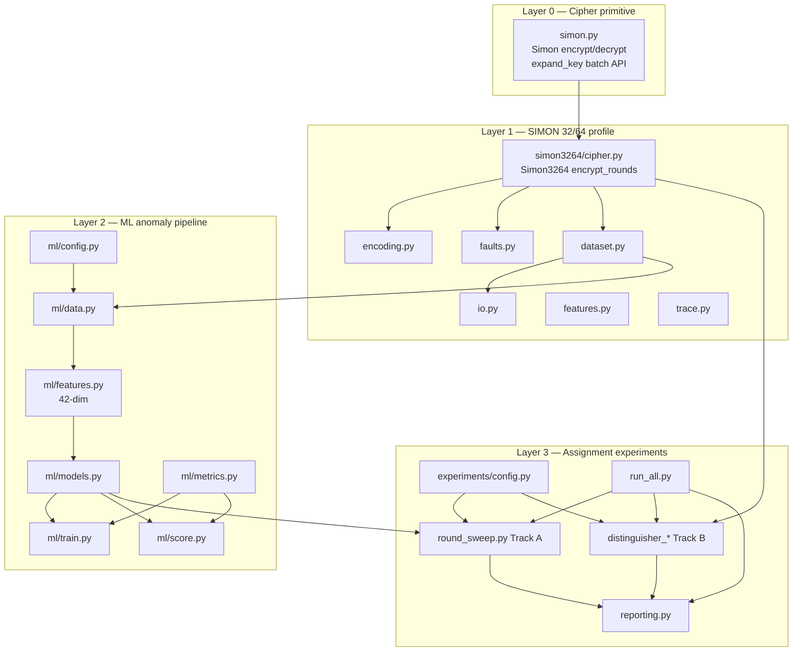
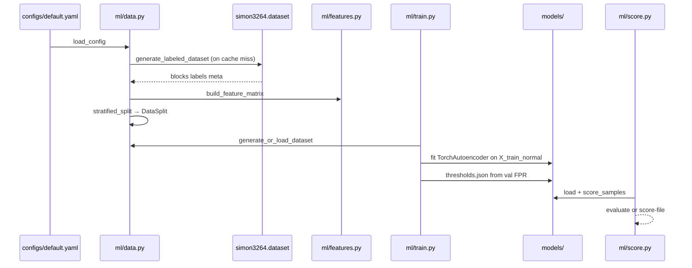
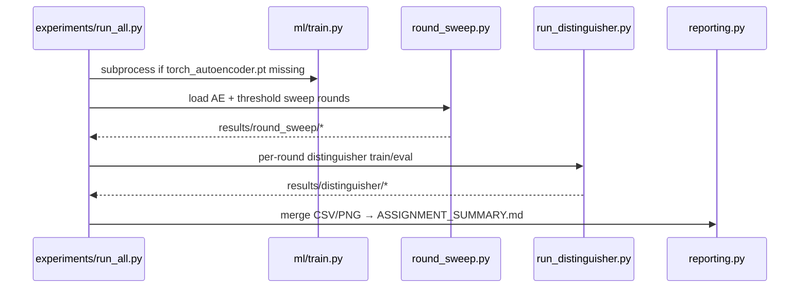
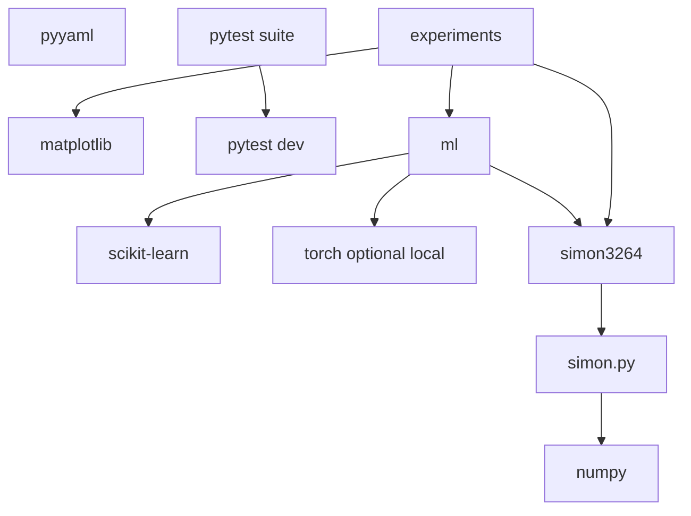

# 02 — System Architecture

## 2.1 Architectural principles

| Principle | How it manifests |
|-----------|------------------|
| **Layered dependencies** | `simon.py` has no ML deps; `simon3264` depends only on `simon`; `ml` depends on `simon3264`; `experiments` depends on `ml` + `simon3264` |
| **Additive assignment layer** | `experiments/` was added without refactoring core cipher or `ml/train.py` |
| **File-based state** | No database; caches and artifacts on disk under `data/`, `models/`, `results/` |
| **Configuration as data** | YAML dataclasses (`ml/config.py`, `experiments/config.py`) + CLI overrides |
| **One-class anomaly training** | Autoencoders fit on **normal rows only**; anomalies evaluated at test time |
| **Reproducibility** | Seeded RNGs; dataset cache keyed by config hash |

**Why layers instead of a monolith?** Cipher correctness can be tested in isolation; ML can evolve without touching round functions; assignment experiments can be optional for users who only need anomaly detection.

---

## 2.2 Layer diagram

---

## 2.3 ML anomaly pipeline — data flow

**Why cache datasets?** Generating tens of thousands of encrypted blocks with fault injection is CPU-heavy. `ml/data.py` hashes the experiment config and stores `data/dataset_<hash>.npz` plus precomputed features.

---

## 2.4 Assignment pipeline — data flow

---

## 2.5 Dual ML paradigms (design choice)

| Paradigm | Module | Training | Inference question |
|----------|--------|----------|-------------------|
| **One-class anomaly** | `ml/models.py` | Normals only (AE/IF) | “Does this block look like training normals?” |
| **Binary distinguisher** | `experiments/distinguisher_model.py` | Real pairs vs random pairs | “Is this pair from reduced-round Simon or random?” |

They share the cipher oracle but **must not be conflated** in reports: Track A uses **42-dim block features** + reconstruction error; Track B default uses **32-bit XOR-of-pair** features.

---

## 2.6 Dependency tree (runtime packages)

See [09 — Configuration reference](09-configuration-reference.md) for `requirements.txt` vs `requirements-colab.txt`.

---

## 2.7 Execution model

- **No long-running server.** All entry points are **CLI scripts** invoked as `python path/to/script.py`.
- **Working directory:** Scripts insert the repository root into `sys.path` (`_REPO` / `_REPO_ROOT` pattern). Run commands from the repo root.
- **No environment variables** are read for configuration (by design). Paths come from YAML `paths:` sections.
- **GPU:** Optional; `TorchAutoencoder` and `NeuralDistinguisher` use `device: auto` → CUDA if available.

---

## 2.8 Extension points

| Extension | Hook |
|-----------|------|
| New fault type | `simon3264/faults.py` + `_apply_fault` in `dataset.py` |
| New block features | `ml/features.py` `build_feature_matrix` |
| New anomaly model | `ml/models.py` + `train.py` / `score.py` |
| New distinguisher features | `experiments/distinguisher_data.py` `pair_to_features` |
| New round-sweep metric | `experiments/round_sweep.py` `evaluate_round` |

---

[← Introduction](01-introduction-and-scope.md) · [Next: Repository layout →](03-repository-layout.md)
