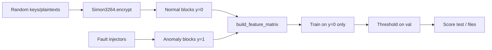

# 06 — `ml/` Anomaly Pipeline

## 6.1 Purpose

The `ml/` package trains and evaluates **anomaly detectors** on fixed-length feature vectors derived from SIMON 32/64 ciphertext blocks. The recommended model for Colab and coursework is the **PyTorch autoencoder** (`TorchAutoencoder`).

**Design philosophy:** Learn the distribution of **normal** 32-round ciphertext in feature space; flag points with high reconstruction error (or low isolation score) at scoring time.

---

## 6.2 End-to-end flow

---

## 6.3 Module reference

| Module | Responsibility |
|--------|----------------|
| `config.py` | `ExperimentConfig` dataclasses; `load_config()` |
| `data.py` | Cache, `DataSplit`, bridge to `generate_labeled_dataset` |
| `features.py` | **Canonical** 42-dim `build_feature_matrix` |
| `models.py` | `IsolationForestModel`, `NumpyAutoencoder`, `TorchAutoencoder` |
| `metrics.py` | FPR threshold, classification metrics, fault tables |
| `train.py` | Training CLI |
| `score.py` | `evaluate` and `score-file` CLIs |

---

## 6.4 `data.py`

### `generate_or_load_dataset(cfg)`

1. Hash relevant config fields → `dataset_<hash>.npz`
2. On hit: load blocks, labels, features, meta JSON
3. On miss:
   - Call `simon3264.dataset.generate_labeled_dataset`
   - Build features via `build_feature_matrix`
   - Save `dataset_<hash>.npz`, `dataset_<hash>_features.npz`, `.meta.json`

### `DataSplit`

| Field | Use |
|-------|-----|
| `X_train`, `X_val`, `X_test` | Feature matrices (float64) |
| `y_*` | Labels |
| `meta_*` | Per-row fault metadata |
| `X_train_normal` | Rows with `y=0` only — **AE training input** |

Splits come from `simon3264.dataset.stratified_split` (label + fault strata).

---

## 6.5 Training paradigm (one-class)

| Model | Training data | Score semantics |
|-------|---------------|-----------------|
| Isolation Forest | `X_train_normal` | Higher = more anomalous (negated sklearn score) |
| NumPy AE | `X_train_normal` (min-max norm) | MSE reconstruction error |
| Torch AE | `X_train_normal` (per-feature min-max) | MSE reconstruction error |

Anomaly rows are **excluded from `fit()`** but used in validation/test for metrics.

**Why one-class?** Real deployments may lack labelled attacks; the model learns “normal” traffic. Synthetic faults proxy unknown anomalies during evaluation.

---

## 6.6 Threshold selection

`ml/metrics.find_threshold_at_fpr(scores, labels, target_fpr=0.01)`:

- Uses **normal** validation scores (`labels == 0`)
- Sets threshold at quantile `(1 - target_fpr)` of normal scores
- Goal: ~1% false positive rate on normals at validation

Stored in `models/thresholds.json` keyed by model name.

---

## 6.7 `train.py` outputs

| Artifact | Content |
|----------|---------|
| `models/iso_forest.pkl` | sklearn IF (unless `--torch-only`) |
| `models/autoencoder.pkl` | NumPy AE (unless `--no-autoencoder` or `--torch-only`) |
| `models/torch_autoencoder.pt` | PyTorch AE (unless `--no-torch`) |
| `models/thresholds.json` | Per-model thresholds |
| `results/val_metrics.json` | Validation metrics dict |

Flags: `--torch-only`, `--no-torch`, `--no-autoencoder`, `--force-regen`, `--n-samples`, `--epochs`.

---

## 6.8 `score.py`

### `evaluate`

Loads test split, applies model + threshold, prints metrics and fault breakdown, writes:

- `results/test_metrics_<model>.json`
- `results/predictions_<model>.csv`

### `score-file`

Loads external `hex` / `bin` / `npz`, builds features with **same flags as config**, scores each block, writes `results/scores_<stem>_<model>.csv`.

**Important:** Feature flags in YAML must match training, or scores are meaningless.

---

## 6.9 Integration with `experiments/`

Track A (`round_sweep.py`) loads `TorchAutoencoder` + `thresholds.json["torch_autoencoder"]` — it does **not** retrain. Ensure `ml/train.py --torch-only` ran first.

---

[← simon3264](05-simon3264-toolkit.md) · [Next: Experiments →](07-experiments-cryptanalysis.md)
