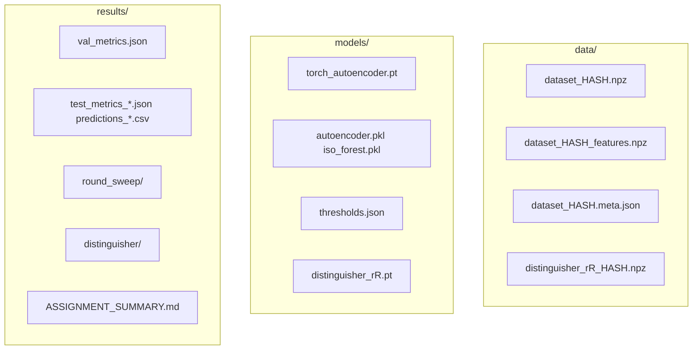

# 08 — Persistence & Artifacts

## 8.1 No database

This project has **no SQL/NoSQL database**, ORM, or migration system. All state is **files on disk**.

**Why files?** Research reproducibility via committed configs + regenerable caches; simple Colab workflow (download/upload `models/`).

---

## 8.2 Artifact topology



---

## 8.3 ML dataset cache (`ml/data.py`)

| File | Keys / content |
|------|----------------|
| `data/dataset_<hash>.npz` | `blocks`, `labels` |
| `data/dataset_<hash>_features.npz` | `features` (and optionally `bits`) |
| `data/dataset_<hash>.meta.json` | List of per-row `meta` dicts |

**Hash inputs:** seed, `n_samples`, anomaly fraction, fault types, split ratios, feature flags.

**Integrity rule:** Changing any hashed field without `--force-regen` loads **stale** data — always force regen after config changes.

---

## 8.4 Distinguisher cache (`experiments/distinguisher_data.py`)

| File | Keys |
|------|------|
| `data/distinguisher_r{r}_{hash}.npz` | `X`, `y`, `rounds` |

**Hash inputs:** rounds, sample count, Δ, feature mode, seed.

Splits are **recomputed** on load (not stored in NPZ).

---

## 8.5 Model artifacts

| Path | Format | Producer |
|------|--------|----------|
| `models/torch_autoencoder.pt` | PyTorch dict: cfg, state_dict, xmin, xmax, input_dim | `ml/train.py` |
| `models/autoencoder.pkl` | pickle | `ml/train.py` |
| `models/iso_forest.pkl` | pickle | `ml/train.py` |
| `models/thresholds.json` | JSON map model_name → float | `ml/train.py` |
| `models/distinguisher_r{r}.pt` | PyTorch dict | `run_distinguisher.py` |

### `thresholds.json` example

```json
{
  "torch_autoencoder": 0.012345,
  "autoencoder": 0.009876,
  "iso_forest": 0.543210
}
```

Track A reads **`torch_autoencoder`** by default (`reference_model` in cryptanalysis yaml).

---

## 8.6 Results artifacts

| Path | Description |
|------|-------------|
| `results/val_metrics.json` | Validation metrics per model |
| `results/test_metrics_<model>.json` | Test evaluation |
| `results/predictions_<model>.csv` | Per-row test scores |
| `results/scores_<file>_<model>.csv` | External file scoring |
| `results/round_sweep/*` | Track A CSV/JSON/PNG |
| `results/distinguisher/*` | Track B metrics CSV/JSON/PNG |
| `results/ASSIGNMENT_SUMMARY.md` | Merged report |

---

## 8.7 Gitignore policy

| Rule | Effect |
|------|--------|
| Root `.gitignore` | Ignores `data/`, `results/`, `models/*.pt`, `*.pkl`, `thresholds.json` |
| `models/.gitignore` | Ignores all except itself |
| `data/.gitignore` | Ignores `*.npz`, `*.meta.json` |

**Do not commit** trained weights or experiment outputs unless your course explicitly requires it (prefer screenshots + config in report).

---

## 8.8 Regeneration commands

```bash
# ML cache + models
python ml/train.py --force-regen

# Distinguisher cache only
python experiments/run_distinguisher.py --force-regen

# Full assignment outputs
rm -rf results/round_sweep results/distinguisher   # optional clean
python experiments/run_all.py --config configs/cryptanalysis.yaml --force-regen
```

---

## 8.9 Data integrity checklist

- [ ] Feature flags in YAML match between train and score
- [ ] `thresholds.json` exists before `round_sweep`
- [ ] Distinguisher cache hash matches current `input_delta` / `feature_mode`
- [ ] Sufficient disk space for `n_samples_per_round` × rounds (distinguisher scales with rounds list)

---

[← Experiments](07-experiments-cryptanalysis.md) · [Next: Configuration →](09-configuration-reference.md)
